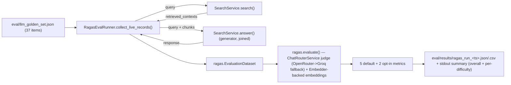
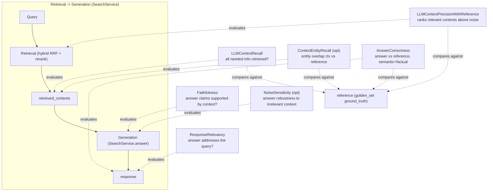

# RAGAS Eval Runner

`eval/ragas_runner.py`. Closes the "no eval runner exists yet" gap noted in [LLM Answer Golden Set](llm_golden_set.md): for each item in `eval/llm_golden_set.json`, calls the **live pipeline** (`SearchService.search()` + `SearchService.answer()`, not the golden set's pre-baked `contexts` field) and scores the result with RAGAS metrics. Resolves the "RAGAS vs custom scoring" open decision in `IMPLEMENTATION_PLAN.md` in favor of RAGAS.

## Components

- `RagasEvalRunner` — service class (matches the repo's existing pattern: [Search Service](/doc/feature/search_service.md), [Hybrid Retriever](/doc/feature/hybrid_search_retrieval.md), [Embedder](/doc/feature/embedder.md)) owning the golden-set-to-scored-result lifecycle:
  - `__init__(search_service=None, judge_model=None)` — builds/accepts a `SearchService`, and the RAGAS judge LLM/embeddings via [RAGAS Adapters](ragas_adapters.md).
  - `load_golden_set(path, limit=None)` — reads `eval/llm_golden_set.json`; `limit` slices to the first N items for smoke tests.
  - `collect_live_records(golden_set)` — for each item: `SearchService.search(query, top_k=5, fetch_k=20)` → `retrieved_contexts`; `"".join(SearchService.answer(query, retrieved_contexts, citations=...))` → `response` (see Generator Join Risk below). Sequential — `SearchService` holds mutable state (`self.last_results`), not documented thread-safe.
  - `build_dataset(records)` — wraps records in `ragas.EvaluationDataset`.
  - `run(golden_set_path, limit=None, include_optional=False)` — orchestrates load → collect → build → `ragas.evaluate()` → write → print.
  - `write_results(result, golden_set)` — writes `eval/results/ragas_run_<UTC-timestamp>.json` and a sibling `.csv` (via `result.to_pandas()`), with `difficulty` joined back in from the golden set. `eval/results/` is gitignored (run artifacts, not source).
  - `print_summary(result, golden_set)` — prints overall per-metric means and a per-difficulty-tier breakdown, since the golden set is stratified by difficulty and an aggregate-only number would hide `hard_distractor`/`no_match` regressions.
- `main()` — thin CLI entrypoint (argparse: `--limit`, `--include-optional`, `--judge-model`), not a class method.

**Import ordering:** `eval.ragas_adapters` must be imported before `ragas` itself in this module (see the `# noqa: E402` comment at the top of the import block) — it registers a `sys.modules` stub that works around an upstream ragas bug (see [RAGAS Adapters](ragas_adapters.md)) before `ragas`'s package-level imports run.

## Metrics

5 default + 2 opt-in (`--include-optional`):

```python
DEFAULT_METRICS = [Faithfulness(), ResponseRelevancy(), LLMContextPrecisionWithReference(),
    LLMContextRecall(), AnswerCorrectness()]
OPTIONAL_METRICS = [NoiseSensitivity(), ContextEntityRecall()]
```

## Data flow



## Metric-to-pipeline-stage mapping



## Generator Join Risk

`SearchService.answer()` is a streaming generator of `str` chunks, not a return value — `collect_live_records` must `"".join(...)` it to get the full response text before handing it to RAGAS. Passing the generator itself would fail deep inside RAGAS's dataset validation rather than at the actual bug site, so `collect_live_records` asserts `answer_text` is a non-empty `str` immediately after the join.

## CLI

```bash
uv run python -m eval.ragas_runner --limit 3                       # smoke test
uv run python -m eval.ragas_runner                                  # full run, default metrics
uv run python -m eval.ragas_runner --include-optional --judge-model openai/gpt-4o-mini
```

Run as a module (`-m eval.ragas_runner`), not as a bare script path — `eval/` has no `__init__.py`, and the module's `from eval.ragas_adapters import ...` absolute import requires the repo root on `sys.path`, which `-m` provides.

## Cost note

Each golden set item costs 1 live pipeline call (embed + rerank + generate) plus multiple judge-LLM calls per metric (RAGAS issues several sub-calls per metric depending on its internal prompting strategy — `AnswerCorrectness` and `LLMContextPrecisionWithReference` are typically the most expensive). A full 37-item run with the 5 default metrics is on the order of hundreds of judge-LLM calls. Set `RAGAS_JUDGE_MODEL` to a cheap-but-capable model rather than relying on the free-tier `chat_model` default for routine runs — the free-tier model observed rate-limit/timeout errors on some metrics during initial smoke testing (see Known Baseline below).

## Known Baseline

First smoke-tested run (`--limit 2`, default `chat_model=openrouter/free` as judge, 2026-09-12 early): `faithfulness=1.0`, `answer_relevancy≈0.96`, `context_recall=1.0` scored cleanly; `llm_context_precision_with_reference` and `answer_correctness` hit `TimeoutError` on the free-tier judge model under concurrent RAGAS sub-calls. **Resolution (2026-09-12 late, commit f2dbae2):** reduced `RunConfig` `max_workers` from 16 to 4 (lower concurrency, less provider rate-limit pressure), raised `timeout` from 180s to 300s (more headroom for transient delays), increased `max_retries` to 10 and `max_wait` to 60s (more robust automatic backoff). Root cause was not a pipeline defect but the old defaults' lack of resilience to provider rate-limits and OpenRouter's transient timeouts under concurrent judge-LLM load. Current baseline: unknown (re-run full eval with a stable judge model to establish regression-tracking scores). Treat this as confirmation the integration loop works end-to-end only.

## Related

- [RAGAS Adapters](ragas_adapters.md) — judge LLM/embeddings factories this runner uses
- [LLM Answer Golden Set](llm_golden_set.md) — the dataset this runner scores against
- [Search Service + Main REPL](/doc/feature/search_service.md) — the live pipeline under eval
- [Retrieval Golden Set](/doc/feature/retrieval_golden_set.md) — sibling golden set for retrieval-ranking-only eval (no runner yet)
</content>
